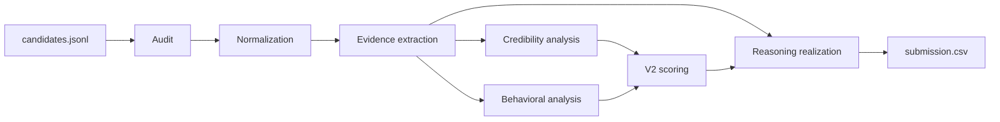

# Beyond Keywords: Evidence-Based Candidate Ranking

Offline CPU-only ranking for the Redrob candidate-ranking challenge. The system ranks candidates from grounded career evidence first, then emits deterministic recruiter-facing reasoning for the top 100.

## Why keyword matching fails

Resume filters over-reward copied skill lists, title inflation, and shallow buzzwords. This project instead prioritizes durable evidence from work history, retrieval or ranking ownership, production delivery, corroborated skills, and bounded recruiter-availability signals.

## Architecture



More detail: [docs/architecture.md](docs/architecture.md)

## Evidence hierarchy

Highest-trust sources:

1. `career_history[*].description`
2. `career_history[*].title`
3. `profile.summary`
4. `profile.headline`
5. `skills[*].name`
6. `skill_assessments[*].name`

Candidate career evidence outranks raw skill lists. Skills help only when corroborated by stronger profile evidence.

## Candidate-ranking pipeline

1. Audit validates schema, duplicates, and the fixed dataset reference date.
2. Normalization creates consistent candidate context without changing candidate content.
3. Evidence extraction maps plain-language profile text into role-aligned categories.
4. Credibility analysis penalizes contradictions and unsupported advanced-skill claims.
5. Behavioral analysis adds a bounded availability and logistics modifier.
6. V2 scoring combines evidence-backed components into a deterministic final score.
7. Reasoning realization selects grounded facts and writes recruiter-facing explanations for the top 100.
8. Submission writing sorts by descending score, then `candidate_id` ascending.

## Anti-keyword-stuffing and credibility defenses

- Unsupported AI or IR buzzwords without matching career evidence weaken the corroborated-skill contribution.
- Contradictory title or description patterns are handled in credibility, not hidden inside the main fit score.
- Risk-heavy evidence never gets converted into positive recruiter-facing explanation text.
- Availability and logistics are bounded, so they can separate similar candidates but cannot rescue an irrelevant profile.

## Behavioral availability modifier

The behavioral multiplier is clamped to `0.72..1.08`. It uses recruiter-relevant signals such as notice period, last-active recency, and location logistics against the fixed dataset reference date in [`configs/runtime.yaml`](configs/runtime.yaml).

## Deterministic reasoning and source grounding

Top-100 explanations are generated through deterministic fact normalization, clause selection, rank-band template selection, cleanup, style linting, and grounding validation. The final release run passed:

- Top-100 style lint: `100/100`
- Top-100 grounding: `100/100`
- First-person recruiter-facing leakage in the final release run: `0`

More detail: [docs/methodology.md](docs/methodology.md)

## Runtime and resource benchmark

Measured final local release run from frozen tag `ranking-freeze-step3b`:

- Runtime: `226.949s`
- Peak memory: `3982.164 MB`
- Memory method: `psutil working set`
- Status: `PASS`

Measured Docker offline reproduction:

- Run `docker_release_full`: `247.042s` summed stage time, `260.723s` container wall time
- Verification run `docker_release_full_2`: `251.110s` summed stage time, `264.855s` container wall time
- Peak memory on verification run: `7132.160 MB`
- Memory method: `docker stats` polling
- Status: warning band `240-270s`, validated and deterministic across repeat runs

## Offline guarantee

- CPU-only ranking: `true`
- Hosted API during ranking: `false`
- Network during ranking: `false`
- GPU dependency: `false`
- Runtime model download: `false`

Semantic scoring is disabled by default in the submitted configuration and safely resolves to zero without external artifacts.

## Setup

```powershell
python -m pip install -r requirements.txt
python -m pip install -r requirements-dev.txt
python -m pip install -r requirements-sandbox.txt
```

Dataset path:

- `data/candidates.jsonl` for the full challenge file
- `data/_tiny_candidates.jsonl` for small smoke runs

## Local run

```powershell
python rank.py --mode v2 --candidates data/candidates.jsonl --out submissions/Team_loading.csv --run-id release_final_local --run-dir runs
python validate_submission.py submissions/Team_loading.csv
python rank.py --mode v2 --resume --candidates data/candidates.jsonl --out submissions/Team_loading.csv --run-id release_final_local --run-dir runs
```

## Docker run

Build:

```powershell
docker build -t redrob-ranker:release .
```

Linux/macOS:

```bash
docker run --rm --network none \
  -v "$(pwd)/data:/data:ro" \
  -v "$(pwd)/submissions:/out" \
  redrob-ranker:release \
  python rank.py \
  --mode v2 \
  --candidates /data/candidates.jsonl \
  --out /out/Team_loading.csv \
  --run-id docker_release_full \
  --run-dir /tmp/runs
```

PowerShell:

```powershell
docker run --rm --network none `
  -v "${PWD}/data:/data:ro" `
  -v "${PWD}/submissions:/out" `
  redrob-ranker:release `
  python rank.py `
  --mode v2 `
  --candidates /data/candidates.jsonl `
  --out /out/Team_loading.csv `
  --run-id docker_release_full `
  --run-dir /tmp/runs
```

More detail: [docs/reproduction.md](docs/reproduction.md)

## Streamlit sandbox

```powershell
streamlit run app.py
```

The sandbox runs the same normalization, evidence, credibility, behavioral, scoring, reasoning, and submission modules as `rank.py`. It is local-only in this repository and is not claimed as publicly hosted.

More detail: [docs/sandbox_deployment.md](docs/sandbox_deployment.md)

## Repository layout

- `rank.py`: CLI entrypoint
- `src/`: ranking pipeline modules
- `configs/`: frozen scoring and runtime configuration
- `app.py`: same-logic Streamlit sandbox
- `sample_data/`: demo sandbox inputs
- `scripts/`: benchmarking, reporting, and release packaging helpers
- `docs/`: architecture, methodology, reproduction, sandbox, and ethics notes
- `presentation/`: final deck, PDF, screenshots, and deck notes
- `release/`: final submission bundle, hashes, manifest, and delivery checklist

## Reproducibility and release manifest

The final release package records:

- frozen tag and commit SHA
- clean working-tree check
- dataset and artifact hashes
- local and Docker runtime measurements
- validator results
- local versus Docker equivalence checks
- exact reproduction commands

See [release/RELEASE_MANIFEST.md](release/RELEASE_MANIFEST.md).

## Limitations and ethics

- This ranker supports recruiter triage. It does not make final hiring decisions.
- It uses profile text only and inherits whatever omissions or ambiguities exist in that text.
- It intentionally avoids fabricated accuracy claims, leaderboard claims, and unsupported business-outcome claims.
- It should be reviewed by humans before any downstream hiring action.

More detail: [docs/limitations_and_ethics.md](docs/limitations_and_ethics.md)

## Tests

```powershell
pytest -q
python rank.py --mode baseline --allow-small-sample --candidates data/_tiny_candidates.jsonl --out submissions/tiny_baseline_release.csv --run-id tiny_baseline_release --run-dir runs
python rank.py --mode v2 --allow-small-sample --candidates data/_tiny_candidates.jsonl --out submissions/tiny_v2_release.csv --run-id tiny_v2_release --run-dir runs
pytest tests/test_sandbox_smoke.py -q
```

## Submission deliverables

- Final submission CSV: [release/final_submission/Team_loading.csv](release/final_submission/Team_loading.csv)
- Validation output: [release/final_submission/validation_output.txt](release/final_submission/validation_output.txt)
- Score invariance report: [release/final_submission/score_invariance_report.json](release/final_submission/score_invariance_report.json)
- Reasoning quality report: [release/final_submission/reasoning_quality_report.json](release/final_submission/reasoning_quality_report.json)
- Submission metadata: [submission_metadata.yaml](submission_metadata.yaml)
- Presentation deck: [presentation/redrob_candidate_ranking_system.pptx](presentation/redrob_candidate_ranking_system.pptx)
- Presentation PDF: [presentation/redrob_candidate_ranking_system.pdf](presentation/redrob_candidate_ranking_system.pdf)
