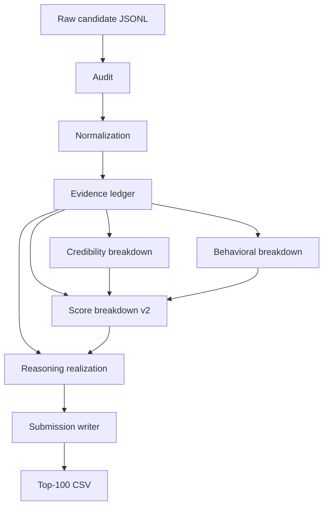

# Architecture

## Objective

Rank `100,000` candidates offline on CPU, emit a valid top-100 submission CSV, and keep the reasoning layer deterministic and source-grounded.

## System diagram

## Stage responsibilities

- Audit: schema checks, duplicate candidate detection, and fixed reference-date enforcement.
- Normalization: stable candidate context and text preparation for downstream extraction.
- Evidence extraction: plain-language mapping from candidate text to retrieval, ranking, production, engineering, and differentiator evidence.
- Credibility: contradiction and unsupported-claim penalties.
- Behavioral: bounded availability and logistics modifier.
- V2 scoring: deterministic component aggregation plus tie-break-safe final ordering.
- Reasoning: fact normalization, clause selection, sentence assembly, style linting, and grounding validation.
- Submission writing: validated CSV with `candidate_id`, `rank`, `score`, `reasoning`.

## Persistence and reproducibility

Each stage writes artifacts under `runs/<run_id>/...`, including the input hash, configuration hashes, stage elapsed times, and source artifact fingerprints. Resume mode skips only when fingerprints still match.

## Sandbox relationship

[`app.py`](../app.py) imports the same core modules as `rank.py` and only limits input size to `100` candidates for a lightweight recruiter demo. It does not use alternate demo scoring.
